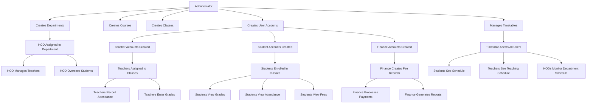

# SMIS - Student Management Information System
## Comprehensive Documentation

### Table of Contents
1. [System Overview](#system-overview)
2. [System Architecture](#system-architecture)
3. [User Roles and Responsibilities](#user-roles-and-responsibilities)
4. [Role Interactions and Workflow](#role-interactions-and-workflow)
5. [Database Schema](#database-schema)
6. [API Endpoints](#api-endpoints)
7. [Frontend Components](#frontend-components)
8. [Security and Authentication](#security-and-authentication)
9. [Deployment and Setup](#deployment-and-setup)

---

## System Overview

**SMIS (Student Management Information System)** is a comprehensive web-based platform designed to digitize and streamline educational institution management. The system provides dedicated portals for different user roles, enabling efficient management of student information, academic processes, financial operations, and administrative tasks.

### Key Objectives
- **Digitization**: Replace paper-based processes with digital workflows
- **Centralization**: Provide a single platform for all academic and administrative operations
- **Transparency**: Enable real-time access to academic and financial information
- **Efficiency**: Streamline communication and reduce manual errors
- **Scalability**: Support growing educational institutions with flexible architecture

### Target Users
- **Students**: Access academic records, attendance, grades, and fee information
- **Teachers**: Manage classes, record attendance, enter grades, and communicate with students
- **Heads of Department (HODs)**: Oversee departmental operations, manage teachers, and monitor performance
- **Finance Personnel**: Handle fee management, payment processing, and financial reporting
- **Administrators**: Manage the entire system, users, and institutional settings

---

## System Architecture

### Technology Stack

#### Backend
- **Runtime**: Node.js (v16+)
- **Framework**: Express.js
- **Database**: MySQL
- **Authentication**: JWT (JSON Web Tokens)
- **Security**: bcryptjs, helmet, CORS
- **Testing**: Mocha, Chai, Supertest

#### Frontend
- **Framework**: Next.js (React)
- **Styling**: Tailwind CSS
- **State Management**: React Context API
- **HTTP Client**: Axios
- **Icons**: React Icons
- **Charts**: Chart.js

#### DevOps
- **Containerization**: Docker
- **Orchestration**: Docker Compose
- **Version Control**: Git
- **Environment Management**: dotenv

### Project Structure
```
SMIS/
├── backend/                 # Backend API server
│   ├── src/
│   │   ├── controllers/     # Route handlers (9 controllers)
│   │   ├── models/          # Database models (13 models)
│   │   ├── routes/          # API routes (10 route files)
│   │   ├── middleware/      # Authentication & validation
│   │   ├── services/        # Business logic services
│   │   ├── config/          # Database & JWT configuration
│   │   └── utils/           # Utility functions
│   ├── tests/               # Unit and integration tests
│   └── server.js            # Main server file
├── frontend/                # Next.js frontend application
│   ├── src/
│   │   ├── components/      # Reusable UI components
│   │   ├── pages/           # Page components
│   │   ├── hooks/           # Custom React hooks
│   │   ├── context/         # React context providers
│   │   ├── services/        # API service functions
│   │   └── utils/           # Utility functions
│   └── public/              # Static assets
├── database/                # Database files
│   ├── schema.sql           # Complete database schema
│   └── migrations/          # Database migration scripts
└── docs/                    # Documentation files
```

---

## User Roles and Responsibilities

### 1. **Administrator** 👨‍💼
**Primary Role**: System-wide management and configuration

#### Responsibilities:
- **User Management**: Create, update, and deactivate user accounts for all roles
- **System Configuration**: Manage system settings, academic calendar, and institutional parameters
- **Department Management**: Create and manage departments, assign HODs
- **Course Management**: Create courses, manage course catalogs
- **Class Management**: Create classes, assign students to classes
- **Timetable Management**: Create and manage master timetables
- **Room Management**: Manage room allocations and facilities
- **Reporting**: Generate system-wide reports and analytics
- **Data Management**: Backup, restore, and maintain system data

#### Key Features:
- Full CRUD operations on all entities
- System monitoring and performance analytics
- User role assignment and permission management
- Academic calendar setup and management
- Bulk operations for data import/export

#### Access Level: **Full System Access**

---

### 2. **Head of Department (HOD)** 👩‍🏫
**Primary Role**: Department-level management and oversight

#### Responsibilities:
- **Teacher Management**: Oversee teachers within their department
- **Course Allocation**: Assign courses to teachers in their department
- **Performance Monitoring**: Monitor teacher and student performance metrics
- **Departmental Reporting**: Generate department-specific reports
- **Timetable Approval**: Review and approve schedule changes for their department
- **Resource Management**: Manage departmental resources and facilities
- **Student Oversight**: Monitor student progress within their department
- **Communication**: Facilitate communication between teachers, students, and administration

#### Key Features:
- Department-specific dashboard with analytics
- Teacher performance monitoring
- Course and class management within department
- Attendance and grade oversight
- Departmental report generation
- Approval workflows for schedule changes

#### Access Level: **Department-Scoped Access**

---

### 3. **Teacher** 👨‍🏫
**Primary Role**: Direct student instruction and assessment

#### Responsibilities:
- **Class Management**: Manage assigned courses and student lists
- **Attendance Recording**: Mark daily attendance for all assigned classes
- **Grade Management**: Enter, update, and manage student grades
- **Assessment Creation**: Create and manage various types of assessments
- **Student Communication**: Communicate with students regarding academic matters
- **Progress Tracking**: Monitor individual student progress
- **Resource Sharing**: Upload and share course materials
- **Report Generation**: Generate class and student performance reports

#### Key Features:
- Class roster management
- Digital attendance marking system
- Grade entry and calculation tools
- Student progress tracking
- Communication tools
- Resource upload and sharing
- Performance analytics for classes

#### Access Level: **Class and Course-Scoped Access**

---

### 4. **Student** 👨‍🎓
**Primary Role**: Academic participation and self-management

#### Responsibilities:
- **Profile Management**: Maintain and update personal information
- **Academic Tracking**: Monitor grades, attendance, and academic progress
- **Schedule Management**: View class schedules and timetables
- **Fee Management**: View fee statements and payment status
- **Communication**: Interact with teachers and receive notifications
- **Resource Access**: Access course materials and announcements
- **Performance Review**: Review academic performance and feedback

#### Key Features:
- Personal dashboard with academic overview
- Real-time grade and attendance viewing
- Interactive timetable and calendar
- Fee status and payment history
- Notification center
- Course material access
- Performance analytics and trends

#### Access Level: **Personal Data Access Only**

---

### 5. **Finance Officer** 💰
**Primary Role**: Financial management and fee administration

#### Responsibilities:
- **Fee Management**: Create, update, and track student fees
- **Payment Processing**: Record and verify fee payments
- **Invoice Generation**: Create and send payment invoices to students
- **Financial Reporting**: Generate financial summaries and analytics
- **Payment Tracking**: Monitor payment status and overdue accounts
- **Audit Trail**: Maintain detailed payment history and transaction logs
- **Communication**: Send payment reminders and financial notifications
- **Reconciliation**: Reconcile payments with bank statements

#### Key Features:
- Comprehensive fee management system
- Payment tracking and status monitoring
- Automated invoice generation
- Financial reporting and analytics
- Payment reminder system
- Transaction history and audit trails
- Integration with payment gateways
- Overdue account management

#### Access Level: **Financial Data Access**

---

## Role Interactions and Workflow

### System Workflow Diagram



### Key Interactions

#### 1. **Admin → All Roles**
- Creates and manages all user accounts
- Sets up system infrastructure (departments, courses, classes)
- Configures system-wide settings and permissions
- Provides system support and maintenance

#### 2. **HOD → Teachers → Students**
- HOD assigns courses to teachers within their department
- Teachers manage classes and interact directly with students
- HOD monitors both teacher performance and student outcomes
- Creates a hierarchical management structure

#### 3. **Finance → Students**
- Finance creates fee records for students
- Students view their fee status and make payments
- Finance processes payments and maintains financial records
- Direct financial communication between finance and students

#### 4. **Cross-Role Data Flow**
- **Attendance Data**: Teachers record → HODs monitor → Admin analyzes
- **Grade Data**: Teachers enter → Students view → HODs review → Admin reports
- **Fee Data**: Finance manages → Students view → Admin oversees
- **Timetable Data**: Admin creates → All roles consume

### Communication Patterns

#### **Hierarchical Communication**
```
Admin
  ├── HOD (Department Level)
  │   ├── Teacher (Class Level)
  │   │   └── Student (Individual Level)
  │   └── Teacher (Class Level)
  │       └── Student (Individual Level)
  └── Finance (Institution Level)
      └── Student (Individual Level)
```

#### **Data Access Patterns**
- **Admin**: Full access to all data across the system
- **HOD**: Department-scoped access to teachers and students
- **Teacher**: Class-scoped access to assigned students
- **Student**: Personal data access only
- **Finance**: Financial data access for all students

---

## Database Schema

### Core Tables Overview

#### **User Management Tables**
1. **`users`** - Staff members (teachers, HODs, finance, admins)
2. **`students`** - Student accounts and profiles
3. **`departments`** - Academic departments

#### **Academic Structure Tables**
4. **`courses`** - Course catalog
5. **`classes`** - Class groups and academic years
6. **`class_courses`** - Many-to-many relationship between classes and courses
7. **`course_enrollments`** - Student course enrollments

#### **Academic Activity Tables**
8. **`attendance`** - Daily attendance records
9. **`grades`** - Student grades and assessments
10. **`timetable`** - Class schedules and time slots

#### **Financial Tables**
11. **`fees`** - Student fee records and payments

#### **System Tables**
12. **`notifications`** - System notifications
13. **`academic_calendar`** - Academic events and holidays
14. **`rooms`** - Room management
15. **`time_configurations`** - Configurable time periods
16. **`time_periods`** - Time slot definitions

### Key Relationships

#### **User Relationships**
```sql
-- Department → HOD (One-to-One)
departments.head_id → users.id

-- Department → Users (One-to-Many)
users.department_id → departments.id

-- Department → Students (One-to-Many)
students.department_id → departments.id
```

#### **Academic Relationships**
```sql
-- Class → Students (One-to-Many via JSON array)
classes.students → [student_ids]

-- Class ↔ Courses (Many-to-Many)
class_courses.class_id → classes.id
class_courses.course_id → courses.id

-- Student ↔ Courses (Many-to-Many)
course_enrollments.student_id → students.id
course_enrollments.course_id → courses.id
```

#### **Activity Relationships**
```sql
-- Attendance tracking
attendance.student_id → students.id
attendance.class_id → classes.id
attendance.course_id → courses.id
attendance.teacher_id → users.id

-- Grade tracking
grades.student_id → students.id
grades.course_id → courses.id
grades.teacher_id → users.id

-- Timetable management
timetable.course_id → courses.id
timetable.teacher_id → users.id
timetable.class_id → classes.id
timetable.room_id → rooms.id
```

### Data Integrity Features
- **Foreign Key Constraints**: Ensure referential integrity
- **Unique Constraints**: Prevent duplicate records
- **Check Constraints**: Validate data ranges and formats
- **Indexes**: Optimize query performance
- **JSON Fields**: Store flexible data structures (student lists, equipment)

---

## API Endpoints

### Authentication Endpoints
```
POST /api/auth/login          # User login
POST /api/auth/logout         # User logout
POST /api/auth/refresh        # Refresh JWT token
```

### Admin Endpoints
```
# User Management
GET    /api/admin/users                    # List all users
POST   /api/admin/users                    # Create new user
PUT    /api/admin/users/:id                # Update user
DELETE /api/admin/users/:id                # Delete user

# Department Management
GET    /api/admin/departments              # List departments
POST   /api/admin/departments              # Create department
PUT    /api/admin/departments/:id          # Update department

# Course Management
GET    /api/admin/courses                  # List courses
POST   /api/admin/courses                  # Create course
PUT    /api/admin/courses/:id              # Update course

# Class Management
GET    /api/admin/classes                  # List classes
POST   /api/admin/classes                  # Create class
PUT    /api/admin/classes/:id              # Update class

# Timetable Management
GET    /api/admin/timetable                # Get timetable
POST   /api/admin/timetable                # Create timetable entry
PUT    /api/admin/timetable/:id            # Update timetable entry
```

### HOD Endpoints
```
# Department Overview
GET /api/hod/department/classes            # Get department classes
GET /api/hod/department/teachers           # Get department teachers
GET /api/hod/department/students           # Get department students

# Performance Monitoring
GET /api/hod/performance/teachers          # Teacher performance metrics
GET /api/hod/performance/students          # Student performance metrics
GET /api/hod/reports/attendance            # Department attendance reports
GET /api/hod/reports/grades                # Department grade reports
```

### Teacher Endpoints
```
# Class Management
GET  /api/teacher/classes                  # Get assigned classes
GET  /api/teacher/classes/:id/students     # Get students in class

# Attendance Management
GET  /api/teacher/attendance/:classId      # Get attendance records
POST /api/teacher/attendance               # Mark attendance
PUT  /api/teacher/attendance/:id           # Update attendance

# Grade Management
GET  /api/teacher/grades/:classId          # Get class grades
POST /api/teacher/grades                   # Enter grades
PUT  /api/teacher/grades/:id               # Update grades

# Timetable
GET /api/teacher/timetable                 # Get teaching schedule
```

### Student Endpoints
```
# Profile Management
GET /api/students/profile                  # Get student profile
PUT /api/students/profile                  # Update profile

# Academic Information
GET /api/students/grades                   # Get grades
GET /api/students/attendance               # Get attendance records
GET /api/students/timetable                # Get class schedule

# Financial Information
GET /api/students/fees                     # Get fee information
```

### Finance Endpoints
```
# Fee Management
GET    /api/finance/fees                   # List all fees
POST   /api/finance/fees                   # Create fee record
PUT    /api/finance/fees/:id               # Update fee record

# Payment Management
GET    /api/finance/payments               # List payments
POST   /api/finance/payments               # Record payment
GET    /api/finance/payments/:studentId    # Get student payments

# Financial Reports
GET /api/finance/reports/summary           # Financial summary
GET /api/finance/reports/overdue           # Overdue payments
GET /api/finance/reports/collections       # Payment collections
```

---

## Frontend Components

### Component Architecture

#### **Admin Components** (`/components/admin/`)
- **UserManagement**: Create, edit, and manage user accounts
- **DepartmentManager**: Department creation and management
- **CourseManager**: Course catalog management
- **ClassManager**: Class creation and student assignment
- **TimetableManager**: Master timetable creation
- **SystemReports**: System-wide analytics and reports
- **Settings**: System configuration and preferences

#### **HOD Components** (`/components/hod/`)
- **DepartmentDashboard**: Department overview and metrics
- **TeacherManagement**: Teacher oversight and performance
- **StudentOverview**: Department student management
- **PerformanceReports**: Department performance analytics

#### **Teacher Components** (`/components/teacher/`)
- **ClassDashboard**: Class overview and management
- **AttendanceMarker**: Digital attendance recording
- **GradeEntry**: Grade input and management
- **StudentProgress**: Individual student tracking
- **TeachingSchedule**: Personal timetable view

#### **Student Components** (`/components/student/`)
- **StudentDashboard**: Personal academic overview
- **GradeViewer**: Grade history and current status
- **AttendanceTracker**: Personal attendance records
- **TimetableView**: Class schedule display
- **FeeStatus**: Financial information display

#### **Finance Components** (`/components/finance/`)
- **FeeManager**: Fee creation and management
- **PaymentProcessor**: Payment recording system
- **FinancialReports**: Financial analytics and reports
- **StudentFinances**: Individual student financial overview

#### **Common Components** (`/components/common/`)
- **Navigation**: Role-based navigation system
- **Dashboard**: Reusable dashboard framework
- **DataTable**: Sortable and filterable data display
- **Modal**: Reusable modal dialogs
- **Form**: Standardized form components
- **Charts**: Data visualization components
- **Notifications**: Alert and notification system

### Page Structure

#### **Authentication Pages**
- `/login` - Universal login page with role detection
- `/forgot-password` - Password reset functionality

#### **Role-Specific Dashboards**
- `/admin` - Administrator dashboard and management
- `/hod` - Head of Department dashboard
- `/teacher` - Teacher dashboard and tools
- `/student` - Student portal and information
- `/finance` - Finance management interface

#### **Shared Pages**
- `/profile` - User profile management
- `/notifications` - Notification center
- `/help` - Help and documentation
- `/settings` - User preferences

---

## Security and Authentication

### Authentication System

#### **JWT Token-Based Authentication**
- **Access Tokens**: Short-lived tokens for API access (24 hours)
- **Refresh Tokens**: Long-lived tokens for token renewal
- **Token Storage**: Secure HTTP-only cookies and localStorage
- **Token Validation**: Middleware validates tokens on protected routes

#### **Password Security**
- **Hashing**: bcryptjs with salt rounds for password hashing
- **Password Policy**: Minimum length and complexity requirements
- **Reset Mechanism**: Secure password reset with time-limited tokens

### Authorization System

#### **Role-Based Access Control (RBAC)**
```javascript
// Middleware example
export const authorize = (...roles) => {
  return (req, res, next) => {
    if (!req.user) {
      return res.status(401).json({ message: 'Authentication required' });
    }
    if (!roles.includes(req.user.role)) {
      return res.status(403).json({ message: 'Insufficient permissions' });
    }
    next();
  };
};
```

#### **Permission Matrix**

| Resource | Admin | HOD | Teacher | Student | Finance |
|----------|-------|-----|---------|---------|---------|
| Users | CRUD | R (Dept) | R (Limited) | R (Self) | R (Limited) |
| Students | CRUD | R (Dept) | R (Classes) | R (Self) | R (All) |
| Courses | CRUD | RU (Dept) | R (Assigned) | R (Enrolled) | R |
| Grades | CRUD | R (Dept) | CRU (Classes) | R (Self) | - |
| Attendance | CRUD | R (Dept) | CRU (Classes) | R (Self) | - |
| Fees | CRUD | - | - | R (Self) | CRUD |
| Timetable | CRUD | R (Dept) | R (Assigned) | R (Self) | R |

*Legend: C=Create, R=Read, U=Update, D=Delete*

### Data Protection

#### **Input Validation**
- **Server-side Validation**: All inputs validated before processing
- **Sanitization**: XSS protection through input sanitization
- **SQL Injection Prevention**: Parameterized queries and ORM usage

#### **Data Encryption**
- **In Transit**: HTTPS/TLS encryption for all communications
- **At Rest**: Database encryption for sensitive data
- **Passwords**: One-way hashing with salt

#### **Security Headers**
```javascript
// Helmet.js security headers
app.use(helmet({
  contentSecurityPolicy: {
    directives: {
      defaultSrc: ["'self'"],
      styleSrc: ["'self'", "'unsafe-inline'"],
      scriptSrc: ["'self'"],
      imgSrc: ["'self'", "data:", "https:"]
    }
  },
  hsts: {
    maxAge: 31536000,
    includeSubDomains: true,
    preload: true
  }
}));
```

---

## Deployment and Setup

### System Requirements

#### **Server Requirements**
- **CPU**: 2+ cores recommended
- **RAM**: 4GB minimum, 8GB recommended
- **Storage**: 50GB minimum for database and files
- **OS**: Linux (Ubuntu 20.04+), Windows Server, or macOS

#### **Software Dependencies**
- **Node.js**: v16 or higher
- **MySQL**: v8.0 or higher
- **Docker**: v20.10+ (optional)
- **Git**: Latest version

### Installation Steps

#### **1. Environment Setup**
```bash
# Clone repository
git clone <repository-url>
cd SMIS

# Copy environment files
cp .env.example .env
cp frontend/.env.local.example frontend/.env.local
```

#### **2. Database Setup**
```bash
# Create MySQL database
mysql -u root -p
CREATE DATABASE smis;
USE smis;
SOURCE database/schema.sql;

# Update .env with database credentials
DB_HOST=localhost
DB_PORT=3306
DB_NAME=smis
DB_USER=your_username
DB_PASSWORD=your_password
```

#### **3. Backend Setup**
```bash
cd backend
npm install
npm run dev  # Development mode
npm start    # Production mode
```

#### **4. Frontend Setup**
```bash
cd frontend
npm install
npm run dev    # Development mode
npm run build  # Production build
npm start      # Production mode
```

#### **5. Docker Deployment (Alternative)**
```bash
# Build and run with Docker Compose
docker-compose up --build

# Run in background
docker-compose up -d
```

### Production Deployment

#### **Environment Configuration**
```env
# Production environment variables
NODE_ENV=production
PORT=5000
DB_HOST=production-db-host
DB_NAME=smis_production
JWT_SECRET=your-super-secure-jwt-secret
FRONTEND_URL=https://your-domain.com
```

#### **Security Checklist**
- [ ] HTTPS/SSL certificates installed
- [ ] Database credentials secured
- [ ] JWT secrets generated and secured
- [ ] CORS configured for production domains
- [ ] Rate limiting implemented
- [ ] Backup strategy implemented
- [ ] Monitoring and logging configured

### Maintenance and Monitoring

#### **Database Maintenance**
- Regular backups (daily recommended)
- Index optimization
- Query performance monitoring
- Data archival for old records

#### **System Monitoring**
- Server resource monitoring (CPU, RAM, disk)
- Application performance monitoring
- Error logging and alerting
- User activity monitoring

#### **Updates and Patches**
- Regular security updates
- Dependency updates
- Feature releases
- Database migrations

---

## Conclusion

The SMIS (Student Management Information System) provides a comprehensive solution for educational institution management through its role-based architecture and feature-rich platform. The system successfully addresses the needs of all stakeholders while maintaining security, scalability, and ease of use.

### Key Benefits
- **Efficiency**: Streamlined processes reduce manual work and errors
- **Transparency**: Real-time access to information for all stakeholders
- **Scalability**: Architecture supports growing institutions
- **Security**: Robust authentication and authorization systems
- **Flexibility**: Configurable system adapts to different institutional needs

### Future Enhancements
- Mobile application development
- Advanced analytics and AI-powered insights
- Integration with external systems (LMS, payment gateways)
- Enhanced communication tools (messaging, video conferencing)
- Multi-language support
- Advanced reporting and dashboard customization

---

*This documentation serves as a comprehensive guide for understanding, deploying, and maintaining the SMIS platform. For technical support or additional information, please refer to the project repository or contact the development team.*
